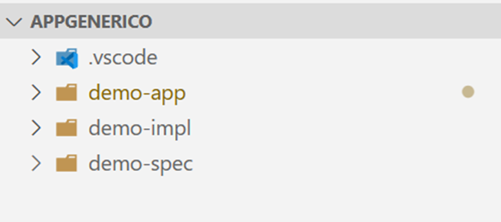
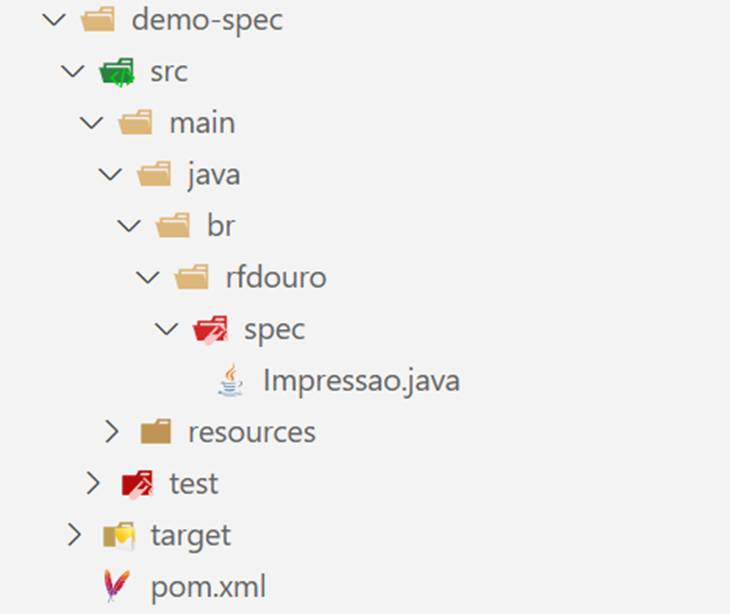
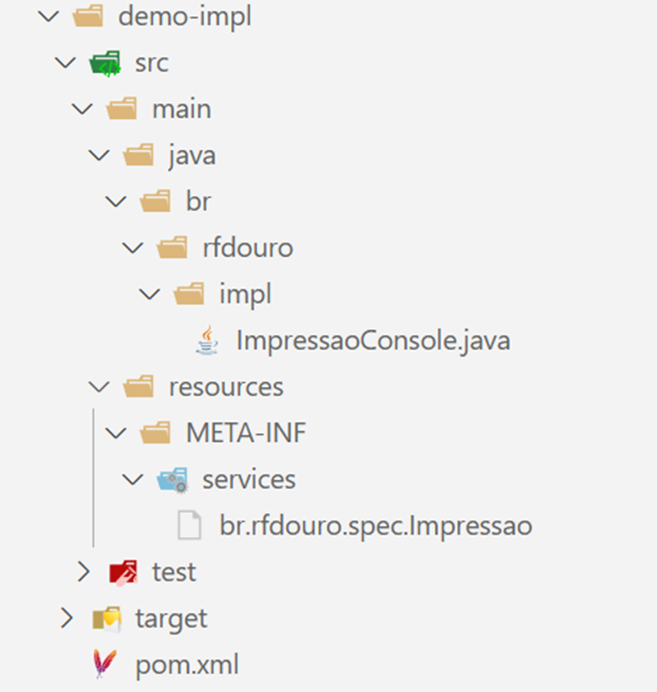
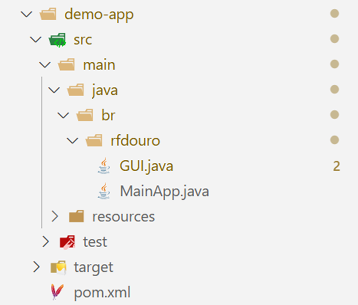
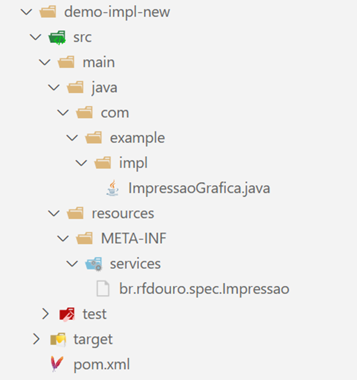

# Exemplo de projeto modular com interface
Para criar uma aplicação Java modular onde você tenha um JAR principal com a interface e outro JAR que a implementa, você pode seguir esta estrutura:
## Estrutura Recomendada
Em uma pasta crie três projetos java maven



## 1. Projeto 1: JAR com a Interface (API)

### Estrutura:
```bash 
demo-spec/
├── src/
│   └── main/
│       └── java/
│           └── br/
│               └── rfdouro/
│                   └── spec/
│                       └── Impressao.java
└── pom.xml
```



### Impressao.java:

``` java
package br.rfdouro.spec;

public interface Impressao {
 String executarAcao(String parametro);

 void configurar(String config);

}
```


### pom.xml (Maven):

``` xml
<?xml version="1.0" encoding="UTF-8"?>
<project xmlns="http://maven.apache.org/POM/4.0.0"
         xmlns:xsi="http://www.w3.org/2001/XMLSchema-instance"
         xsi:schemaLocation="http://maven.apache.org/POM/4.0.0 http://maven.apache.org/xsd/maven-4.0.0.xsd">
    <modelVersion>4.0.0</modelVersion>

    <groupId>br.rfdouro</groupId>
    <artifactId>demo-spec</artifactId>
    <version>1.0</version>
    <packaging>jar</packaging>

    <properties>
        <maven.compiler.source>17</maven.compiler.source>
        <maven.compiler.target>17</maven.compiler.target>
    </properties>

</project>
```


## 2. Projeto 2: JAR com a Implementação

### Estrutura:

``` bash
demo-impl/
├── src/
│   └── main/
│       └── java/
│           └── br/
│               └── rfdouro/
│                   └── impl/
│                       └── ImpressaoConsole.java
│       └── resources/
│           └── META-INF/
│               └── services/
│                   └── br.rfdouro.spec.Impressao
└── pom.xml
```



### ImpressaoConsole.java:

``` java
package br.rfdouro.impl;

import br.rfdouro.spec.Impressao;

public class ImpressaoConsole implements Impressao {
 @Override
 public String executarAcao(String parametro) {
  System.out.println("Executando ação no console: " + parametro);
  return "Resultado da ação: " + parametro;
 }

 public void configurar(String config) {
  System.out.println("Configurando no console: " + config);
 }

}
```


### br.rfdouro.spec.Impressao

``` bash
br.rfdouro.impl.ImpressaoConsole
```


### pom.xml:

``` xml
<?xml version="1.0" encoding="UTF-8"?>
<project xmlns="http://maven.apache.org/POM/4.0.0"
    xmlns:xsi="http://www.w3.org/2001/XMLSchema-instance"
    xsi:schemaLocation="http://maven.apache.org/POM/4.0.0 http://maven.apache.org/xsd/maven-4.0.0.xsd">
    <modelVersion>4.0.0</modelVersion>

    <groupId>br.rfdouro</groupId>
    <artifactId>demo-impl</artifactId>
    <version>1.0</version>
    <packaging>jar</packaging>

    <dependencies>
        <dependency>
            <groupId>br.rfdouro</groupId>
            <artifactId>demo-spec</artifactId>
            <version>1.0</version>
        </dependency>
    </dependencies>

    <properties>
        <maven.compiler.source>17</maven.compiler.source>
        <maven.compiler.target>17</maven.compiler.target>
    </properties>

</project>
```


## 3. Projeto 3: Aplicação Principal com Interface Gráfica

### Estrutura:

``` bash
demo-app/
├── src/
│   └── main/
│       └── java/
│           └── br/
│               └── rfdouro/
│                   ├── GUI.java
│                   └── MainApp.java
└── pom.xml
```



### MainApp.java:

``` java
package br.rfdouro;

import java.io.File;
import java.net.URL;
import java.net.URLClassLoader;
import java.util.ServiceLoader;

import javax.swing.SwingUtilities;

import br.rfdouro.spec.Impressao;

public class MainApp {
    private Impressao servico;

    // Usa o classloader da aplicação ou indica um JAR externo para carregar a implementação
    // Se nenhum JAR for passado, tenta carregar a implementação do classpath da aplicação
    // Se um JAR for passado, tenta carregar a implementação do JAR externo
    // Lança exceção se não encontrar a implementação
    // A implementação deve estar declarada no arquivo META-INF/services/br.rfdouro.spec.Impressao
    // Exemplo de uso:
    // java -cp demo-app.jar;impl-externa.jar br.rfdouro.MainApp
    // ou
    // java -cp demo-app.jar br.rfdouro.MainApp impl-externa.jar
    public void carregarImplementacao() throws Exception {
        // Usando ServiceLoader para carregar a implementação
        ServiceLoader<Impressao> serviceLoader = ServiceLoader.load(Impressao.class);

        servico = serviceLoader.findFirst()
                .orElseThrow(() -> new RuntimeException("Implementação não encontrada"));
    }

    // Carrega a implementação de um JAR externo
    // Usa a pesquisa por um JAR externo
    // Efetuada na janela da aplicação
    public void carregarImplementacao(File jarFile) throws Exception {
        URL[] urls = { jarFile.toURI().toURL() };
        URLClassLoader classLoader = new URLClassLoader(urls, getClass().getClassLoader());

        // Usando ServiceLoader para carregar a implementação
        ServiceLoader<Impressao> serviceLoader = ServiceLoader.load(Impressao.class, classLoader);

        servico = serviceLoader.findFirst()
                .orElseThrow(() -> new RuntimeException("Implementação não encontrada"));
    }

    public Impressao getServico() {
        return servico;
    }

    public static void main(String[] args) {
        SwingUtilities.invokeLater(() -> {
            new GUI().setVisible(true);
        });
    }

}
```


### GUI.java:

``` java
package br.rfdouro;

import javax.swing.*;

import br.rfdouro.spec.Impressao;

import java.awt.*;
import java.io.File;
import java.util.ServiceLoader;

public class GUI extends JFrame {
 private MainApp app;
 private JTextArea outputArea;

 public GUI() {
  app = new MainApp();
  initializeUI();
 }

 private void initializeUI() {
  setTitle("Aplicação Modular");
  setDefaultCloseOperation(JFrame.EXIT_ON_CLOSE);
  setSize(600, 400);
  setLocationRelativeTo(null);

  // Painel principal
  JPanel panel = new JPanel(new BorderLayout());

  // Botão para carregar JAR
  JButton loadButton = new JButton("Carregar Implementação");
  loadButton.addActionListener(e -> carregarJar());

  try {
   // Tenta carregar a implementação padrão
   // Se falhar, o usuário pode carregar um JAR externo
   // para fornecer a implementação
   // Se não houver implementação padrão, o botão de carregar JAR permanece ativo
   // para que o usuário possa carregar uma implementação
   // Se houver implementação padrão, desabilita o botão de carregar JAR
   app.carregarImplementacao();
   loadButton.setEnabled(false);
   outputArea = new JTextArea("Implementação padrão carregada.\n");
  } catch (Exception ex) {
   System.out.println("Erro ao carregar serviço: " + ex.getMessage());
  }

  // Área de texto para output
  outputArea = new JTextArea();
  outputArea.setEditable(false);

  // Botão para executar ação
  JButton executeButton = new JButton("Executar Ação");
  executeButton.addActionListener(e -> executarAcao());

  // Layout
  JPanel buttonPanel = new JPanel();
  buttonPanel.add(loadButton);
  buttonPanel.add(executeButton);

  panel.add(buttonPanel, BorderLayout.NORTH);
  panel.add(new JScrollPane(outputArea), BorderLayout.CENTER);

  add(panel);
 }

 private void carregarJar() {
  JFileChooser fileChooser = new JFileChooser();
  fileChooser.setFileFilter(new javax.swing.filechooser.FileNameExtensionFilter("JAR files", "jar"));

  int result = fileChooser.showOpenDialog(this);
  if (result == JFileChooser.APPROVE_OPTION) {
   File selectedFile = fileChooser.getSelectedFile();
   try {
    app.carregarImplementacao(selectedFile);
    outputArea.append("JAR carregado com sucesso: " + selectedFile.getName() + "\n");
   } catch (Exception ex) {
    JOptionPane.showMessageDialog(this, "Erro ao carregar JAR: " + ex.getMessage());
   }
  }
 }

 private void executarAcao() {
  try {
   String resultado = app.getServico().executarAcao("Teste");
   outputArea.append("Resultado: " + resultado + "\n");
  } catch (Exception ex) {
   JOptionPane.showMessageDialog(this, "Erro ao executar: " + ex.getMessage());
  }
 }
}

```


## Build e Execução

### Buildando os projetos:

``` bash
# Projeto Interface
cd demo-spec
mvn clean install
```

``` bash
# Projeto Implementação
cd demo-impl
mvn clean install
```

``` bash
# Aplicação Principal
cd demo-app
mvn clean package
```

### Executando:

``` bash
java -jar demo-app/target/demo-app-1.0-SNAPSHOT.jar
```

Esta estrutura permite que você desenvolva e atualize a implementação independentemente da aplicação principal, seguindo os princípios de arquitetura modular e inversão de dependência.

É possível executar carregando diretamente uma implementação ou não. 

Estando no diretório da aplicação compilada (demo-app/target):

``` bash
java -cp demo-app-1.0-SNAPSHOT.jar;..\..\demo-impl\target\demo-impl-1.0.jar;..\..\demo-spec\target\demo-spec-1.0.jar br.rfdouro.MainApp
```

Caso não queira carregar a implementação:

``` bash
java -cp demo-app-1.0-SNAPSHOT.jar;..\..\demo-spec\target\demo-spec-1.0.jar br.rfdouro.MainApp
```


## Alterando a implementação

É possível criar uma nova implementação e usá-la.

### Novo projeto de implementação.

Crie um projeto Java Maven chamado demo-impl-new com a seguinte estrutura.

### Estrutura:

``` bash
demo-impl-new/
├── src/
│   └── main/
│       └── java/
│           └── com/
│               └── example/
│                   └── impl/
│                       └── ImpressaoGrafica.java
│       └── resources/
│           └── META-INF/
│               └── services/
│                   └── br.rfdouro.spec.Impressao
└── pom.xml
```



### pom.xml

``` xml
<?xml version="1.0" encoding="UTF-8"?>
<project xmlns="http://maven.apache.org/POM/4.0.0"
    xmlns:xsi="http://www.w3.org/2001/XMLSchema-instance"
    xsi:schemaLocation="http://maven.apache.org/POM/4.0.0 http://maven.apache.org/xsd/maven-4.0.0.xsd">
    <modelVersion>4.0.0</modelVersion>

    <groupId>com.example</groupId>
    <artifactId>demo-impl-new</artifactId>
    <version>1.0</version>
    <packaging>jar</packaging>

    <dependencies>
        <dependency>
            <groupId>br.rfdouro</groupId>
            <artifactId>demo-spec</artifactId>
            <version>1.0</version>
        </dependency>
    </dependencies>

    <properties>
        <maven.compiler.source>17</maven.compiler.source>
        <maven.compiler.target>17</maven.compiler.target>
    </properties>

</project>
```

### ImpressaoGrafica.java

``` java
package com.example.impl;

import javax.swing.JOptionPane;

import br.rfdouro.spec.Impressao;

public class ImpressaoGrafica implements Impressao {
 @Override
 public String executarAcao(String parametro) {
  // Exibe uma mensagem gráfica
  // Usa JOptionPane para mostrar a mensagem
  JOptionPane.showMessageDialog(null, "Executando ação gráfica: " + parametro);
  return "Resultado da ação: " + parametro;
 }

 public void configurar(String config) {
  JOptionPane.showMessageDialog(null, "Configurando impressão gráfica: " + config);
 }

}
```


### br.rfdouro.spec.Impressao
``` bash
com.example.impl.ImpressaoGrafica
```


### Build da implementação

No diretório do projeto

``` bash
mvn clean install
```

### Executando com nova implementação

Executando a aplicação com a nova implementação
Para executar a aplicação com a nova implementação basta indicá-la ou na linha de comandos ou na interface gráfica.

Para a linha de comandos acesse o diretório target da aplicação e execute:

``` bash
java -cp demo-app-1.0-SNAPSHOT.jar;..\..\demo-impl-new\target\demo-impl-new-1.0.jar;..\..\demo-spec\target\demo-spec-1.0.jar br.rfdouro.MainApp
```

## Verificação de JAR

É possível verificar a estrutura de um arquivo .jar

``` bash
jar tf demo-app-1.0-SNAPSHOT.jar
```

Isso deve exibir algo como

``` bash
META-INF/
META-INF/MANIFEST.MF
br/
br/rfdouro/
META-INF/maven/
META-INF/maven/br.rfdouro/
META-INF/maven/br.rfdouro/demo-app/
br/rfdouro/GUI.class
br/rfdouro/MainApp.class
META-INF/maven/br.rfdouro/demo-app/pom.xml
META-INF/maven/br.rfdouro/demo-app/pom.properties
```
O que podemos extrair de informações:

* Os pacotes existentes no arquivo
  * ```br/rfdouro/```
* As classes no arquivo
  * ```br/rfdouro/MainApp.class```

